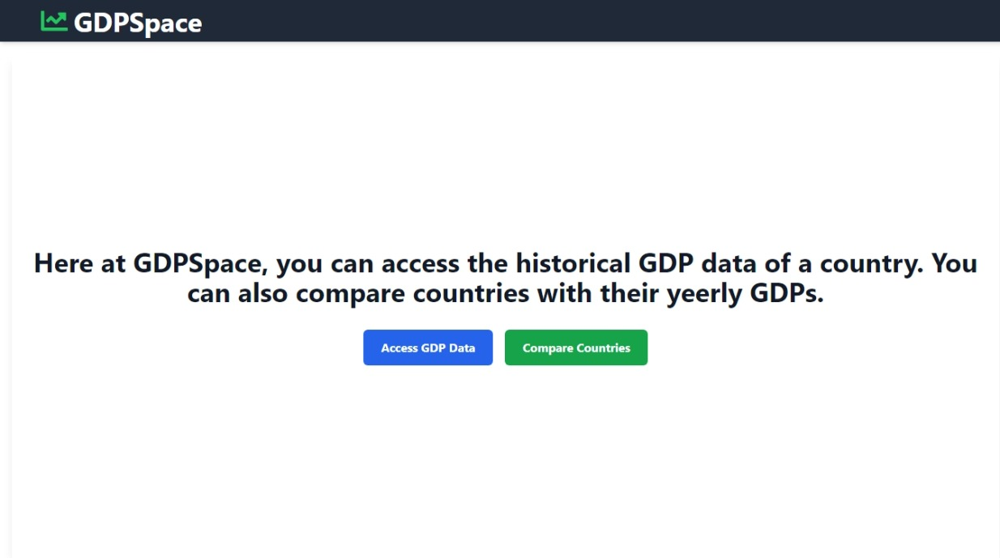
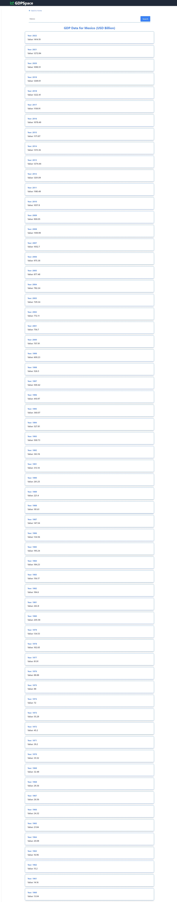
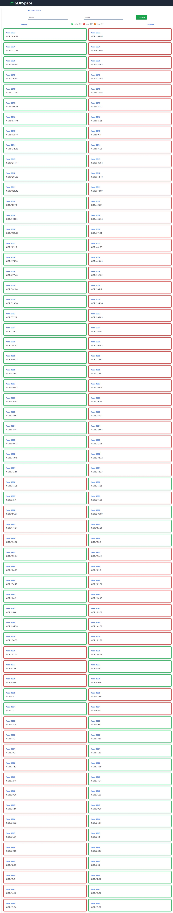

# GDPSpace

## About

This project is a web application that allows users to view the GDP history of a country or compare the GDPs of multiple countries across various years. The data is fetched from the Trading Economics API, providing reliable and up-to-date information.

## Technologies Used

- [Node.js](https://nodejs.org/): A JavaScript runtime.
- [ReactJS](https://reactjs.org/): A JavaScript library for building user interfaces.
- [Vite](https://vitejs.dev/): A frontend build tool.
- [Trading Economics API](https://docs.tradingeconomics.com/): Provides macroeconomic data, historical information, and trading data.

## Getting Started

To get started with the project, follow these steps:

1. Clone the project to your local machine.
2. Navigate to the project directory in your terminal.
3. Change directory into the "React" folder.
4. Run `npm install` to install the project dependencies.
5. Run `npm run dev` to start the development server.

After running the `npm run dev` command, the development server will start and the application will be available at `http://localhost:<port>`. The port will be specified by the dev server when it starts.

To build the project, run `npm run build`. This will create a production-ready version of the app in the `dist` folder.

Alternatively, you can visit the already built version of the app in the `dist` folder.

Please ensure that you have Node.js version 14.18+, 16+ installed on your machine to avoid any compatibility issues.

## Screenshots

### Landing page

### Search GDP page

### Compare GDPs page

## License

[MIT](https://choosealicense.com/licenses/mit/)
